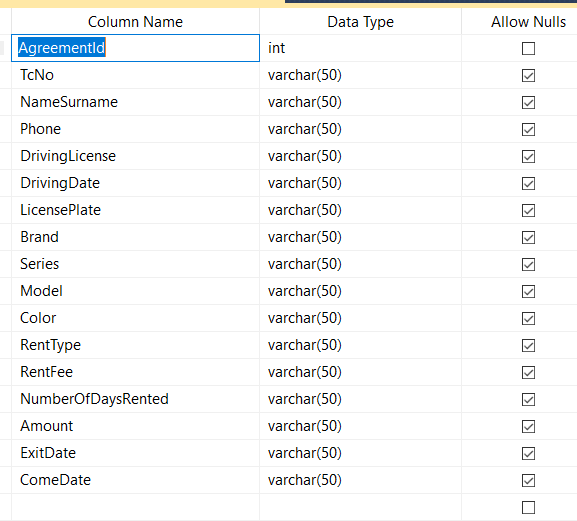
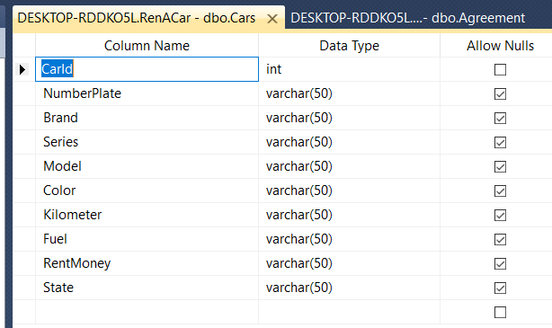
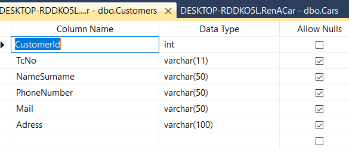
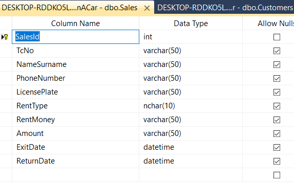

# Car Rental System

A desktop-based Car Rental Automation System developed using .NET Framework and Windows Forms. This application is designed to manage a car rental company’s operations, including cars, customers, rentals, returns, and payments. The system uses a local SQL Server database to store all necessary information securely and efficiently.

## Project Overview

This project is intended as a comprehensive car rental management solution for small to medium-sized rental companies. It provides user-friendly interfaces to handle daily operations such as vehicle registration, customer tracking, rental contracts, and payment processing.

## Features

- Add, update, delete cars
- Customer registration and management
- Rent and return car operations
- Real-time availability tracking
- Payment tracking
- Admin authentication (login panel)
- Dashboard with rental statistics
- Input validation and error handling

## Screenshots

### Login Screen

### Dashboard

### Car List View

### Rental Form

### Reports Panel

## Technologies Used

- Language: C#
- Framework: .NET Framework (WinForms)
- Database: Microsoft SQL Server
- UI: Windows Forms
- IDE: Visual Studio
- Data Access: ADO.NET

## Installation

1. Clone the repository: git clone https://github.com/mrkankilic27/car-rental-system.git

2. Open the `.sln` file in Visual Studio.

3. Ensure that SQL Server is installed and running locally.

4. Restore NuGet packages if prompted.

## Database Setup

1. Open SQL Server Management Studio (SSMS).

2. Create a new database named: rentacar

3. Execute the `rentacar.sql` script included in the project directory to create necessary tables and insert sample data.

4. Verify that the connection string in the project matches your local SQL Server instance.

## Usage

- Launch the application using Visual Studio (Start Debugging).
- Log in using the credentials defined in the database.
- Begin managing vehicles, customers, and rental operations from the main dashboard.

## Contributing

Contributions are welcome. Fork the repository and submit a pull request for review.

## License

This project is licensed under the MIT License.

## Author

Mertcan Kankılıç  
GitHub: https://github.com/mrkankilic27  
Email: mertcankankilic27@gmail.com

